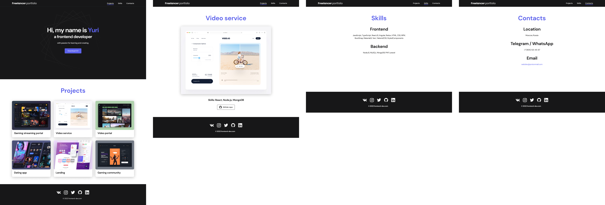

# $\color{red}\textsf{My portfolio}$

$\color{limegreen}\text{Учебная работа}$

## $\color{mediumblue}\text{Описание работы }$:

Несколько страниц на git pages с информацией обо мне и моих навыках , контактной информацией и примерами некоторых работ.

За основу взят макет из [видео-урока](https://www.youtube.com/watch?v=tYdnepSqtNE) , свёрстан и доработан с учётом имеющихся навыков.

**Цели и задачи работы :**

❗Изучить способ внедрения кнопки переключения "сетлой/тёмной" темы на сайт.

❗Внедрение кнопки переключения двух языков на странице.

❗Работа c CSS переменными.

❗Изучить способ внедрения кнопки слайдёра на страницу с помощью библиотеки "swiperjs".

🎯 Основная задача - Практика и улучшение навыков вёрстки .

---

Макет -> [**Figma**](https://www.figma.com/design/tMOSNDbDEyMmcirz6cQ6WE/React-Simple-Portfolio?node-id=0-1&p=f&t=TLBwEpMocCT185gW-0)

Вёрстка -> [**Git pages**](https://artiom-work.github.io/my-portfolio/)

---

## $\color{mediumblue}\text{Технологии, инструменты и способы вёрстки }$:

✅ Библиотека Swiperjs
✅ СSS Переменные
✅ БЭМ
✅ Flex
✅ Grid
✅ Адаптивная вёрстка
✅ Мобильное меню (CSS+JS)
✅ Кнопка переключения ночной темы (CSS+JS)
✅ Кнопка переключения языка (CSS+JS)
✅ Анимации (CSS+JS)
✅ Git
✅ Figma

---
